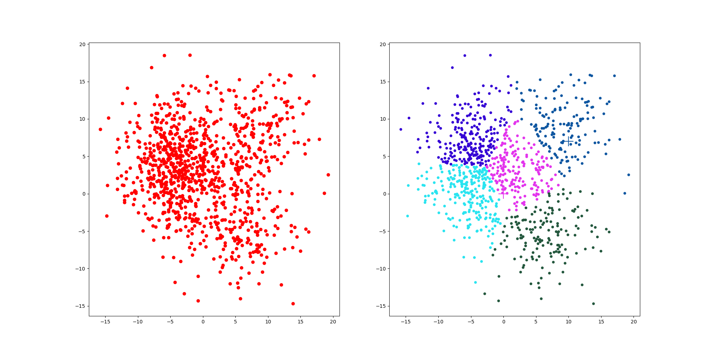

### 1. 基于卷积神经网络的自编码器

#### Environment

代码基于Python和PyTorch 1.10.0实现，可以使用以下命令安装环境：

```python
conda create -n ans_w python=3.7
conda activate ans_w
pip install -r requirements.txt
```

#### AutoEncoder


Auto-Encoder，中文称作自编码器，是一种无监督式学习模型。它基于反向传播算法与最优化方法（如梯度下降法)，利用输入数据X本身作为监督，来指导神经网络尝试学习一个映射关系，从而得到一个重构输出X'。

#### Train

[options](./CNN-AE/options.py)文件中设置训练集路径，如需使用GPU，请修改device为cuda。

```
python train.py
```

#### Demo

```python
python test.py
```


简单训练了1个epoch用于测试。

### 2. K-Means

#### Environment

这一项目的环境在1中执行环境配置时已经成功配置，无需重复创建。

#### K-means

```c++
获取数据 n 个 m 维的数据
随机生成 K 个 m 维的点
while(t)
    for(int i=0;i < n;i++)
        for(int j=0;j < k;j++)
            计算点 i 到类 j 的距离
    for(int i=0;i < k;i++)
        1. 找出所有属于自己这一类的所有数据点
        2. 把自己的坐标修改为这些数据点的中心点坐标
end
```

**时间复杂度**： O(tknm) ，其中，t 为迭代次数，k 为簇的数目，n 为样本点数，m 为样本点维度。

**空间复杂度**： O(m(n+k)) ，其中，k 为簇的数目，m 为样本点维度，n 为样本点数。

#### Demo

[test](./KMeans/test.py)文件中，n_clusters是预先设定的聚类簇个数，num_centers是随机生成的数据的类个数，使用sklearn库提供的make_blobs构造随机样本，并通过cluster_std控制几个类的离散程度。

```python
python test.py
```



左图是未进行聚类的初始分布，右图是聚类结果，+为测试点的类别分布。